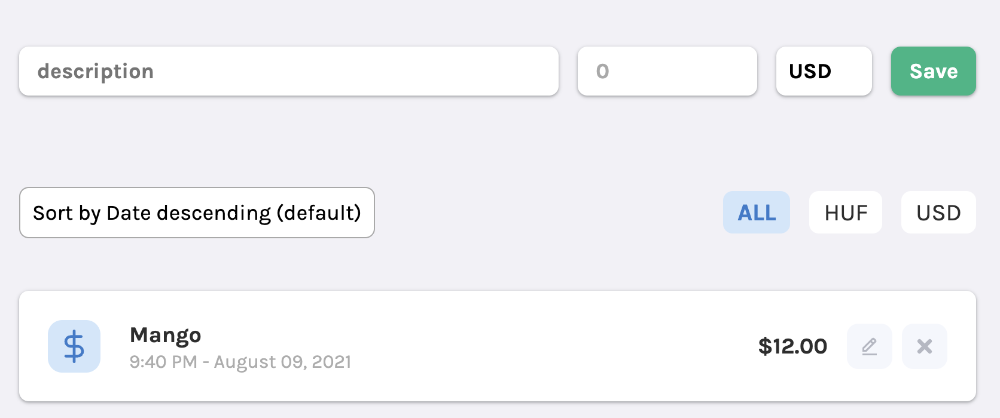

# Polygence Coding Challenge

Welcome to the coding challenge portion of the Polygence Engineering interview! Thank you for taking the time to go through this exercise and show us what you can contribute to the team.

## Project overview



We want you to create a simple application to track spendings.

A spending has the followings properties:

- when it happened
- how much did we spend
- in what currency
- for what/description

This simple web app allows the users to:

- Create a new spending
- List all the spendings
- List all the spendings ordered by amount, date
- List all the spendings filtered by currency

A spending JSON object looks something like this:

```json
{
  "description": "Mango",
  "amount": 1200,
  "spent_at": "2022-02-23T14:47:20.381Z",
  "currency": "USD"
}
```

### Technical requirements

- Use Git and share the project on GitHub
- The backend solution can be written in any programming language
  - We have created a scaffolded Python/Flask and a Node.js/Express version
  - But you can start from scratch in any language
- No need for any SQL database to store data, you can store the data in memory

### Acceptance criteria

```cucumber
Given there are no existing spendings
When I fill the description, currency and amount
And I click the "Save" button
Then I see my spending in the list
And the spending is persisted on the server
And the form is emptied

Given that I have not filled the description or the amount
When I click the "Save" button
Then I see an error indicating the missing field

Given there are existing spendings in the list
When I change the selected ordering
Then the list is reorder by the selection

Given there are existing spendings in the list
When I click on a currency filter button (HUF, USD, All)
Then the list is filtered by that selection
And shows only the matching spendings
```

### What We Look For

This is an opportunity for you to show us what your best code looks like. While we expect the code to work, we are also looking for:

- Clean, modular code
- Clear naming and conventions
- Unit tests
- Error handling

If there are any pre-existing patterns in the code that you don't like, feel free to change them!

### Not required, but nice to have

- Use a web framework (eg. Django)
- Persist data in an SQL based database

## Getting Started

### Option #1: Run the Python/Flask API

This project is best run using **Python 3.7.9**.

Install python dependencies:

```shell
cd python && pip install -r requirements.txt
```

Run the python tests:

```shell
cd python && pytest tests.py
```

Run the API (http://localhost:5000):

```shell
cd python && FLASK_APP=app python -m flask run
```

### Option #2: Run the Node/Express API

This project is best run using **Node 14.17.x**.

```shell
cd node && npm i
```

Run the node tests:

```shell
cd node && npm test
```

Run the API (http://localhost:5000):

```shell
cd node && npm start
```

### Both: Run the JS/React Web Client

This project is best run using **Node 14.17.x**.

Install client dependencies:

```shell
cd web && npm i
```

Run the client tests:

```shell
cd web && npm test
```

Run the client (http://localhost:3000):

```shell
cd web && npm start
```
